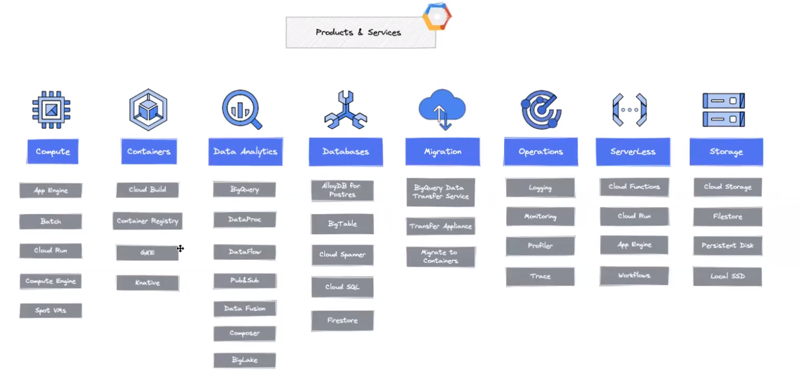

## Regional/Zonal
- Google Cloud consist of a set of physical assets, such as computers and hard disks drives and virtual resources such as  virtual machines
- Google Cloud Platform with network (Virtual Private Cloud) is the global scope
- Region is collection of zones
- Region layout: us-central1
- Static external ip addresses are provisioneded in regions
- Resources are provisioneded in zones
- zones layout: us-central-1-a
- [list of regions/zones](https://cloud.google.com/compute/docs/regions-zones)
- complaince: southamerica-east1
- more services: us-central-1

## Products

## Products for Data Engineer
- Cloud Run
- GKE
- DataProc
- DataFlow
- Pub&Sub
- BigQuery
- Data Fusion
- Composer
- Big Lake
- Cloud SQL
- AlloyDB for Postgres
- BigQuery Data Transfer Service
- Logging
- Monitoring
- Profiler
- Trace
- Cloud Functions
- Cloud Storage

## Projects
- One organization has many projects
- Any GCP resource is allocated in a Project
- Project is like a namespace
- Each project has a billing account
- Projects can't access another project's resources by default

## Identity & Access Management IAM
- Fine-grained Access Control & Visibility for centrally managing cloud resources
- Single Access Control Interface: IAM provides a simple and consistent access control interface for all services. Learn one access control interface and apply that knowledge to all Google Cloud resources
- Fine-Grained Control: Grant access to users at a resource level of granularity, rather than just project level. For example, you can create an IAM access control policy that grants the Subscriber role to a user for a particular Pub/Sub topic
- Automated Access Control Recommendations: Remove unwanted access to resources with smart access control recommendations. Using recommender you can automatically detect overly permissive access and rightsize them based on similar users in the organizarion and their access patterns
- Context-Aware Access: Control access to resources based on contextual attributes like device security status, IP address, resource type and date/time
- Flexible roles: Prior to IAM tou could only grant Owner, Editor an Viewer roles to users. A wide range of services and resources now surface additional IAM roles out of the box. For example,the Pub/Sub service exposes Publisher and Subscriber roles.
- Web, Programmatic & CLI: create and manage IAM policies using the console, the IAM methods and the gcloud command line tool

## Google Stack development
- Git: cloud source repositories
- Vscode: cloud shell editor
- Esteira: Cloud Builder
- Registry: Artifact registry
